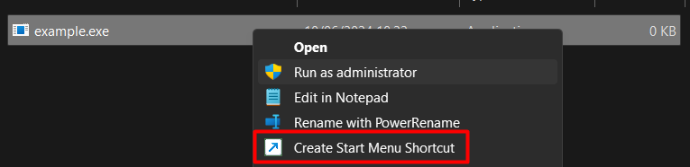

# Create Start Menu Shortcut

This script adds a context menu option to create a Start Menu shortcut for any file.



## Installation

1. **Clone the repository**:
    ```sh
    git clone https://github.com/xAdSFx/AddToStartMenu.git
    cd AddToStartMenu
    ```

2. **Run the install script**:
    - Double-click `install.bat` to apply the registry changes.

3. **Verify**:
    - Right-click on any file and ensure the "Create Start Menu Shortcut" option appears and works as expected.

## Uninstallation

1. **Remove the context menu entry**:
    - Double-click `remove_context_menu.reg` to remove the context menu entry.

## Files

- `CreateStartMenuShortcut.ps1`: PowerShell script to create the shortcut.
- `SilentRun.vbs`: VBS wrapper to run the PowerShell script silently.
- `add_context_menu.reg`: Registry file to add the context menu option.
- `remove_context_menu.reg`: Registry file to remove the context menu option.
- `shortcut.ico`: Custom icon file for the context menu entry.
- `install.bat`: Installation script.

## Customization

- To change the icon, modify the `Icon` value in `add_context_menu.reg`.
- Ensure all paths in the scripts are correct and accessible.

## License

This project is licensed under the MIT License.
